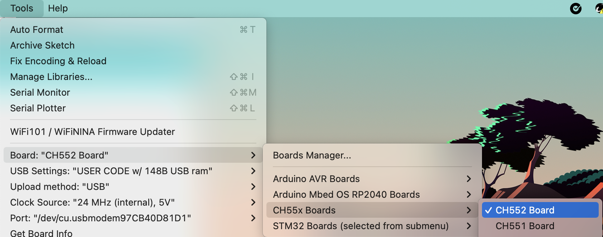
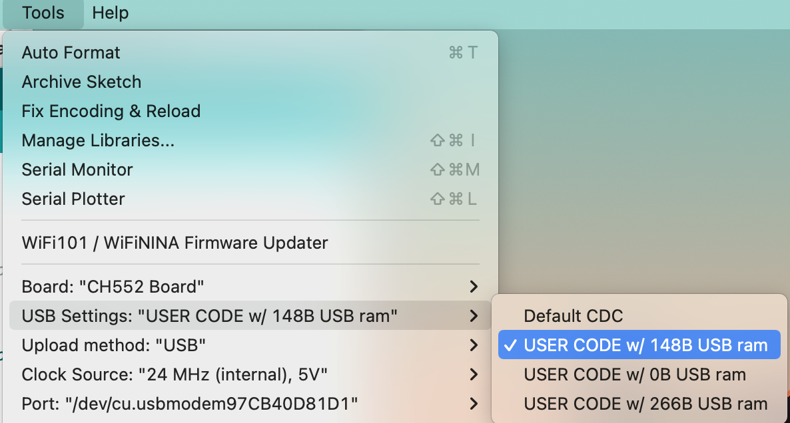
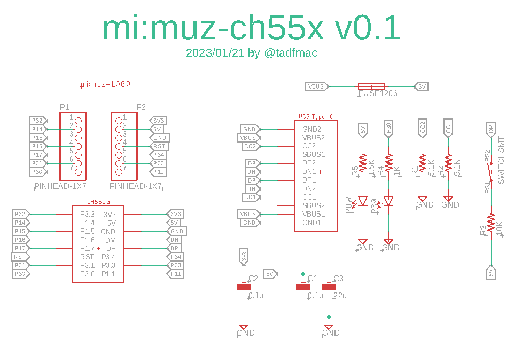

# mi:muz:ch55x Tiny USB MIDI Library for Ch55xduino


An Tiny library of USB MIDI for Deqing Sun's [Ch55xduino](https://github.com/DeqingSun/ch55xduino).

Support only 3 MIDI messages are :

- MIDI Note ON
- MIDI Note OFF
- MIDI Control Change

## Usage

### 1. Installing Arduino Software to your PC

Download and install the IDE for your environment from the URL below.

https://www.arduino.cc/en/software

### 2. Adding Ch55xduino to Arduino IDE

Add Deqing Sun's Ch55xduino to Arduino IDE by referring to the URL below.

https://github.com/DeqingSun/ch55xduino

### 3. Installing this library

Enter the following command in your terminal software to download this library.

```
cd <your arduino library path>
git clone git@github.com:mimuz/mimuz-ch55x.git
```

Please restart the Arduino IDE.

### 4. Programming your CH55x board

First select the your Board from `Tools > Board > CH55x Boards`.
For example, your board is a CH552 board, select `CH552 Board`.



Next, Select USB RAM Setting to `USER CODE w/ 148B USB ram` from `[Tools > USB Settings]`.



Uploading method is the same as the standard method of Ch55xduino.

Boards that have never been programmed with ch55xduino must be programmed with DFU. (Hold down the BOOT button and connect to USB)
After the second time, you can write via USB serial.

## APIs

### Initializer

#### `USBInit()`

Initialize the mi:muz functions. Call `USBInit()` on `setup()`.

### Event handler

#### `processMIDIMessage()`

This function is a event handler.    
When any MIDI event received, it call the callback functions.    
If your application set any callback functions to handle MIDI Event, `processMIDIMessage()` should place in `loop()`.    

### callback function registers

These callback function registers are set callback functions that called when MIDI message received.    
If you need to receive MIDI Message, be sure to call any function before `USBInit()` in `setup()`.    

#### `setHdlNoteOff(hdlNoteOff pfunc)`

Registers a callback function to be called when a `MIDI Note OFF` message is received.    
Make the Callback function to be set to parameter with the following prototype.

```
void onHandleNoteOff(__xdata uint8_t ch, __xdata uint8_t note);

- __xdata uint8_t ch : MIDI Channel
- __xdata uint8_t note : Note Number
```

#### `setHdlNoteOn(hdlMidiMessage pfunc)`

Registers a callback function to be called when a `MIDI Note ON` message is received.    
Make the Callback function to be set to parameter with the following prototype.

```
void onHandleNoteOn(__xdata uint8_t ch, __xdata uint8_t note, __xdata uint8_t vel);

- __xdata uint8_t ch : MIDI Channel
- __xdata uint8_t note : Note Number
- __xdata uint8_t vel : Velocity

```

#### `setHdlCtlChange(hdlMidiMessage pfunc)`

Registers a callback function to be called when a `MIDI Control Change` message is received.    
Make the Callback function to be set to parameter with the following prototype.

```
void onHandleControlChange(__xdata uint8_t ch, __xdata uint8_t num, __xdata uint8_t val);

- __xdata uint8_t ch : MIDI Channel
- __xdata uint8_t num : Control Number
- __xdata uint8_t val : Value

```

### MIDI Event senders

#### `sendNoteOn(uint8_t ch, uint8_t note, uint8_t vel)`

Send a MIDI Note On msessage.

#### `sendNoteOff(uint8_t ch, uint8_t note)`

Send a MIDI Note Off msessage.

#### `sendCtlChange(uint8_t ch, uint8_t num, uint8_t value)`

Send a MIDI Control Change msessage.

## Licenses

LGPL2.1

## About USB VID/Pid

Currently this library uses the PID issued from [pid.code](https://pid.codes) for [mimuz-can Lite](https://pid.codes/1209/DF02/). Because we are planning the next version of mimuz-can Lite as the first product using the library.    
It is not appropriate to use this PID for different products, so please change the VID/PID when using it.    

## for Simple Testing (examples/midi-callback)

Write [midi-callback](./examples/midi-callback), connect the ch55x board with LED connected to P30 to your PC with a USB cable, and open the following site with a Chrome browser.

- [testing site](https://mimuz.github.io/mimuz-ch55x/)    

The LED should blink at intervals of approximately 1 second.

## Reference Board Design (v1.0)

mimuz:ch55x supports various CH55x boards, We made a reference board design for mimuz-ch55x as an example.

### board preview

    

### schematics



### Autodesk EAGLE data

- [Autodesk Eagle Data (.sch .brd .lbr)](./board/eagle)
